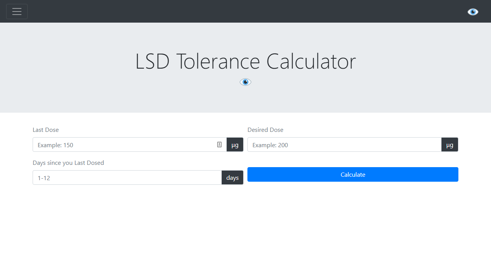

<!-- PROJECT LOGO -->
 

  

<h3 align="center">LSD Tolerance Calculator</h3>

  

    Harm reduction Project. Easy to use LSD Calculator based on a 12 days tolerance reset.
     
  

<!-- TABLE OF CONTENTS -->

  
Table of Contents

  <ol>
    <li>
      <a href="#about-the-project">About The Project</a>
      <ul>
        <li><a href="#built-with">Built With</a></li>
      </ul>
    </li>
    
    <li><a href="#usage">Usage</a></li>
    <li><a href="#roadmap">Roadmap</a></li>
    <li><a href="#contributing">Contributing</a></li>
    <li><a href="#license">License</a></li>
    <li><a href="#contact">Contact</a></li>
    <li><a href="#acknowledgments">Acknowledgments</a></li>
  </ol>

<!-- ABOUT THE PROJECT -->
## About The Project

  )

Here's a blank template to get started: To avoid retyping too much info. Do a search and replace with your text editor for the following: `github_username`, `repo_name`, `twitter_handle`, `linkedin_username`, `email`, `email_client`, `project_title`, `project_description`

(<a href="#top">back to top</a>)

### Built With

* [Bootstrap](https://getbootstrap.com)

(<a href="#top">back to top</a>)

<!-- GETTING STARTED -->

<!-- ROADMAP -->
## Roadmap

 [] Feature 1
 [] Feature 2
 [] Feature 3
 [] Nested Feature

(<a href="#top">back to top</a>)

<!-- CONTRIBUTING -->
## Contributing

Contributions are what make the open source community such an amazing place to learn, inspire, and create. Any contributions you make are **greatly appreciated**.

If you have a suggestion that would make this better, please fork the repo and create a pull request. You can also simply open an issue with the tag "enhancement".
Don't forget to give the project a star! Thanks again!

1. Fork the Project
2. Create your Feature Branch (`git checkout -b feature/AmazingFeature`)
3. Commit your Changes (`git commit -m 'Add some AmazingFeature'`)
4. Push to the Branch (`git push origin feature/AmazingFeature`)
5. Open a Pull Request

(<a href="#top">back to top</a>)

<!-- LICENSE -->
## License

Distributed under the MIT License. See `LICENSE.txt` for more information.

(<a href="#top">back to top</a>)

<!-- CONTACT -->
## Contact

Jose Ferri - [@LinkedIn](https://www.linkedin.com/in/jose-ferri/) - joe@ferri.works
             @Discord - Spooky#1340

Project Link: [https://github.com/lsdtolerancecalculator/lsdtolerancecalculator.github.io](https://github.com/lsdtolerancecalculator/lsdtolerancecalculator.github.io)

(<a href="#top">back to top</a>)

